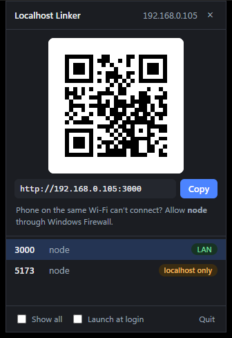

# Localhost Linker

A Windows tray app that finds the dev servers running on your machine and gives you a QR code
your phone can scan to open them over Wi-Fi. No more typing `192.168.1.5:3000` on a phone keyboard.

<p align="center"></p>

## Download

Get the installer or the portable zip from the
[latest release](https://github.com/JP-Discoveries/localhost-linker/releases/latest).
Windows 10 or 11 with the WebView2 runtime is required; Windows 11 already has it.

## Features

### Finds your servers automatically
- Reads the OS table of listening TCP ports every 2 seconds, with no admin rights needed.
- Shows the process that owns each port: node, python, dotnet and so on.
- Hides OS plumbing and background apps. Tick **Show all** to see everything.

### Tells you whether a phone can actually reach it
- **LAN** means the server listens on all interfaces, so the QR code works.
- **localhost only** means a phone can't connect. The popup shows the flag that fixes it,
  such as `npm run dev -- --host` for Vite.

### Picks the right IP address
- Skips VPN, WSL, Hyper-V and other virtual adapters.
- Prefers `192.168.x.x`, then `10.x.x.x`, then `172.16-31.x.x`, using the OS default route
  only to break ties. This matters because a VPN usually owns the default route.

### Stays out of the way
- Click the tray icon to open the popup; click away or press Esc to hide it.
- Copy a URL with the button, a double-click, or Ctrl+C.
- Optional **Launch at login**, from the popup or the tray menu.
- Around 0.1% CPU when idle, and it only talks to the popup while it is open.

## Tech stack

Rust and [Tauri v2](https://v2.tauri.app/). The popup is a single HTML file with no build step.
Key crates: `listeners` for the socket table, `local-ip-address`, and `qrcode`.

## Building

Requires Rust stable (MSVC toolchain), the Visual Studio C++ build tools, and the Tauri CLI.

```sh
cargo install tauri-cli --version "^2.0.0" --locked

cd src-tauri
cargo test                                     # unit tests
cargo test live_scan -- --ignored --nocapture  # print what the app sees on this machine
cargo tauri dev                                # run it
cargo tauri build                              # NSIS installer in target/release/bundle/nsis
```

## Project layout

| Path | Purpose |
|---|---|
| `src-tauri/src/lib.rs` | Tray, popup window, polling thread, commands |
| `src-tauri/src/scanner.rs` | Socket table to server list: filtering, dedupe, reachability |
| `src-tauri/src/ip.rs` | LAN IPv4 selection |
| `src-tauri/src/qr.rs` | QR code as inline SVG |
| `ui/index.html` | The popup |

## Known limits

- Only Windows is built and tested. The crates are cross-platform.
- If a phone still can't connect to a **LAN** server, Windows Firewall is usually blocking
  the dev server's process. The app can't change that for you.
- Servers inside WSL 2 in its default NAT mode aren't reachable from a phone. Turn on
  mirrored networking in WSL to fix that.
